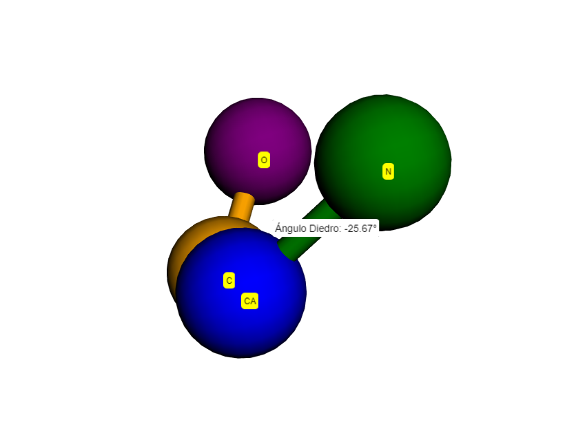

# Estructuras en tres dimensiones con Biopython

<div align="justify">
    
Este documento presenta un conjunto de ejercicios prácticos centrados en la bioinformática estructural y en el uso de herramientas computacionales como Biopython para analizar y manipular datos biológicos, específicamente relacionados con estructuras de proteínas y secuencias.

---

<br>

## **Ejercicio 1: Proteína de la hemoglobina humana**

En primer lugar, el archivo en formato PDB se descarga utilizando la función personalizada `download_pdb`, la cual obtiene el archivo a partir del identificador único de la proteína proporcionado por la base de datos PDB (Protein Data Bank). El código de la función se presenta a continuación:

```python
def download_pdb(pdb_id, route=None):
    pdb_id = pdb_id.lower()
    url = f"https://files.rcsb.org/download/{pdb_id.upper()}.pdb"
    respuesta = requests.get(url)

    if respuesta.status_code == 200:
        if route is None:
            route = f"{pdb_id.upper()}.pdb"
        else:
            if not route.endswith(".pdb"):
                route += ".pdb"
        with open(route, 'w') as archivo:
            archivo.write(respuesta.text)
        print(f"Archivo PDB '{pdb_id.upper()}.pdb' descargado exitosamente en '{route}'.")
        return route
    else:
        raise Exception(f"No se pudo descargar el PDB. Código de estado HTTP: {respuesta.status_code}")
```

La función utiliza el módulo `requests` para enviar una solicitud HTTP al servidor de PDB, valida la respuesta del servidor y, en caso de éxito, guarda el archivo en el directorio especificado por el usuario o en una ubicación predeterminada.

Posteriormente, se emplean dos herramientas para la visualización interactiva de estructuras tridimensionales de proteínas: la librería `nglview` y la librería `py3Dmol`. Estas herramientas permiten explorar las estructuras en detalle y generar representaciones gráficas. En la Figura 1 se muestra la estructura tridimensional de la hemoglobina humana, generada a partir del archivo descargado y visualizada con `py3Dmol`.

<div align="center">
    
    <p><b>Figura 1.</b> Representación tridimensional de la estructura de la hemoglobina humana.</p>
</div>

Finalmente, el archivo descargado se carga en Biopython para su análisis estructural. Esto se logra creando un objeto de tipo estructura mediante el módulo `PDBParser` de Biopython, como se ilustra en el siguiente código:

```python
parser = PDBParser(QUIET=True)
pdb_code = "1A3N"
structure = parser.get_structure(pdb_code, f"./files/{pdb_code}.pdb")
```

El objeto `structure` contiene toda la información sobre la organización atómica y molecular de la proteína, permitiendo realizar análisis y cálculos adicionales, como los descritos posteriormente.

### (a) Calcula la distancia entre los átomos O del primer y último residuo de la cadena A de la hemoglobina

Para calcular la distancia entre los átomos de oxígeno (O) correspondientes al primer y último residuo de la cadena A, se siguen los pasos descritos a continuación:

1. **Obtención de los residuos**. Se extraen el primer y último residuo de la cadena A utilizando el modelo de la estructura cargada:

```python
model = next(structure.get_models())  # Obtiene el primer modelo
chain_A = model['A']  # Selecciona la cadena A
residues = list(chain_A.get_residues())  # Lista de residuos en la cadena
first_residue = residues[0]  # Primer residuo
last_residue = residues[-1]  # Último residuo
```

2. **Obtención de los átomos de interés**. Se emplea la función `get_atom` para extraer los átomos de oxígeno (O) de los residuos seleccionados:

```python
def get_atom(residue, atom_id):
    try:
        return residue[atom_id]  # Recupera el átomo especificado
    except KeyError:
        print(f"El residuo {residue.get_resname()} {residue.id[1]} no tiene un átomo '{atom_id}'.")
        return None
 ```

3. **Cálculo de la distancia**. Una vez obtenidos los átomos, se calcula la distancia entre ellos en angstroms. Para ello, se define la función `calculate_distance`, que utiliza la operación de resta disponible para los objetos de tipo átomo en Biopython:

```python
def calculate_distance(atom1, atom2):
    distance = atom1 - atom2  # Calcula la distancia en línea recta
    return distance
```

4. **Visualización de la distancia calculada**. La distancia se representa visualmente mediante una imagen tridimensional, donde se destacan los átomos de interés. La **Figura 2** ilustra esta distancia en línea recta entre los átomos O del primer y último residuo:

<div align="center">
    
    <p><b>Figura 2.</b> Distancia entre los átomos O del primer y último residuo de la cadena A.</p>
</div>

### (b) Calcula el ángulo diedro entre los átomos N,CA,C, y O del primer residuo de la cadena A

El ángulo diedro es un ángulo de torsión que describe la disposición espacial de cuatro átomos conectados de forma secuencial. Este tipo de ángulo está estrechamente relacionado con las conformaciones locales y las estructuras secundarias de las proteínas, como las hélices alfa y las hojas beta. 

1. **Obtención de los átomos**. Se extraen los átomos especificados (N, CA, C y O) del primer residuo de la cadena A utilizando la función `get_atom`:

```python
atom_N = get_atom(first_residue, 'N')
atom_CA = get_atom(first_residue, 'CA')
atom_C = get_atom(first_residue, 'C')
atom_O = get_atom(first_residue, 'O')
```

2. **Extracción de las coordenadas**. Se obtienen los vectores posicionales de cada uno de los átomos seleccionados:

```python
coord_N = atom_N.get_vector()
coord_CA = atom_CA.get_vector()
coord_C = atom_C.get_vector()
coord_O = atom_O.get_vector()
```

3. **Cálculo del ángulo diedro**. Se utiliza la función `calc_dihedral` de Biopython, que calcula el ángulo de torsión basado en las posiciones de los cuatro átomos. El resultado, inicialmente en radianes, se convierte a grados mediante la función `np.degrees`:

```python
angle = calc_dihedral(coord_N, coord_CA, coord_C, coord_O)
angle_degrees = np.degrees(angle)
```
   
<div align="center">
    
    <p><b>Figura 3.</b> Ángulo diedro de los cuatro átomos.</p>
</div>

En este caso, el ángulo diedro calculado es de **-25.67º**. Este valor negativo indica que el ángulo de torsión está en el sentido contrario a las agujas del reloj cuando se observa desde el vector definido por los átomos N y CA hacia el vector definido por los átomos C y O.
Un ángulo diedro de **-25.67º** sugiere una ligera torsión que podría estar asociada con la formación de estructuras secundarias específicas, aunque no es un valor característico de una hélice alfa ni una hoja beta, que suelen tener ángulos más definidos. Este resultado destaca la flexibilidad conformacional del residuo inicial en la cadena A de la hemoglobina, un aspecto importante para su función biológica y estabilidad estructural.

### (c) Calcula el centro de masas de la estructura de la hemoglobina

El **centro de masas (center of mass)** de una estructura molecular se calcula como el promedio ponderado de las coordenadas de todos los átomos en la estructura, donde el peso de cada átomo es su masa. La fórmula es la siguiente:

$$
\text{Centro de masas (COM)} = \frac{\sum (m_i \cdot r_i)}{\sum m_i}
$$

Donde:
- $m_i$ es la masa del átomo $i$ (generalmente el peso atómico de su elemento).
- $r_i$ es el vector de coordenadas (x, y, z) del átomo $i$.
- La suma se realiza sobre todos los átomos de la estructura.

Información de las masas atómicas: [Disponible aquí](https://www.lenntech.es/periodica/masa/masa-atomica.htm)

1. **Identificación de los elementos presentes en la estructura**. Se recorren todos los átomos de la estructura para identificar los elementos únicos presentes. Esto permite asociar las masas atómicas adecuadas a cada elemento:

```python
unique_elements = set()
for atom in structure.get_atoms():
    element = atom.element.strip().upper()
    unique_elements.add(element)
```
En el caso de la hemoglobina, los elementos identificados son: `'FE'`(Hierro), `'O'`(Oxígeno), `'S'`(Sulfuro), `'N'`(Nitrógeno) y `'C'`(Carbono).

2. **Cálculo de las coordenadas ponderadas por la masa**. Para cada átomo, se extraen sus coordenadas ($x, y, z$)) y se ponderan por su masa atómica. Al mismo tiempo, se acumula la masa total de todos los átomos:

```python
atomic_mass = 0.0
sum_x = 0.0
sum_y = 0.0
sum_z = 0.0
for atom in structure.get_atoms():
    element = atom.element.strip().upper()
    masa = get_mass(element)  # Función que retorna la masa atómica
    x, y, z = atom.get_coord()
    atomic_mass += masa
    sum_x += masa * x
    sum_y += masa * y
    sum_z += masa * z
```

3. **Obtención del centro de masas**. Dividiendo las coordenadas ponderadas ($\sum m_i \cdot x, \sum m_i \cdot y, \sum m_i \cdot z$) por la masa total ($\sum m_i$), se obtiene el centro de masas como un vector tridimensional:

```python
centro_masas = np.array([sum_x, sum_y, sum_z]) / atomic_mass
```

4. **Visualización del resultado**. El centro de masas calculado ($14.45, 2.01, 13.18$) se representa gráficamente para resaltar su posición en la estructura de la hemoglobina. En la **Figura 4**, se observa el centro de masas como un punto destacado en la estructura tridimensional:

<div align="center">
    
    <p><b>Figura 4.</b> Centro de masas de la hemoglobina representado como un punto destacado.</p>
</div>

En el caso de la hemoglobina, se encuentra cerca del núcleo de la estructura, lo cual es consistente con su configuración compacta y su función biológica de transporte de oxígeno en el organismo. Este análisis puede ser extendido a otras proteínas para evaluar la distribución de masa y su relación con propiedades estructurales y funcionales.

---

<br>

## **Ejercicio 2: Proteína lisozima del huevo de la gallina**

En primer lugar, al igual que en el ejercicio 1, el archivo en formato PDB se descarga utilizando la función personalizada `download_pdb`, la cual obtiene el archivo a partir del identificador único de la proteína proporcionado por la base de datos PDB (Protein Data Bank).

Posteriormente, se emplean dos herramientas para la visualización interactiva de estructuras tridimensionales de proteínas: la librería `nglview` y la librería `py3Dmol`. 

<div align="center">
    
    <p><b>Figura 5.</b> Representación tridimensional de la estructura de la lisozima.</p>
</div>

Finalmente, el archivo descargado se carga en Biopython para su análisis estructural. Esto se logra creando un objeto de tipo estructura mediante el módulo `PDBParser`. El objeto `structure` contiene toda la información sobre la organización atómica y molecular de la proteína, permitiendo realizar análisis y cálculos adicionales, como los descritos posteriormente.

### (a) Número de átomos y nombres del primer y último átomo en la lista

Este apartado tiene como objetivo determinar el número total de átomos presentes en la estructura de la lisozima y especificar el nombre del primer y último átomo en la lista de átomos de la estructura.

1. **Obtención de la lista de átomos**. Se genera una lista que contiene todos los átomos de la estructura utilizando el método `get_atoms`:

```python
atoms = list(structure.get_atoms())
```

2. **Cálculo del número total de átomos**. La longitud de la lista de átomos se determina mediante la función `len`, lo que proporciona el número total de átomos en la estructura:

```python
num_atoms = len(atoms)
```
En este caso, la proteína de la lisozima contiene **$1.102$** átomos.

3. **Obtención de los nombres del primer y último átomo**. Se acceden al primer y último átomo en la lista mediante índices y se extraen sus nombres utilizando el método `get_name`:

```python
first_atom = atoms[0].get_name()
last_atom = atoms[-1].get_name()
```

En este caso:
- El **primer átomo** es un átomo de nitrógeno (`N`).
- El **último átomo** es un átomo de oxígeno (`O`).

4. **Visualización de los resultados**. La **Figura 6** muestra la estructura tridimensional de la lisozima, donde se destacan claramente el primer y el último átomo:

<div align="center">
    
    <p><b>Figura 6.</b> Primer y último átomo de la lisozima.</p>
</div>

El análisis realizado confirma que la estructura de la lisozima contiene un total de **1,102 átomos**. El **primer átomo** identificado es un átomo de nitrógeno (`N`), y el **último átomo** es un átomo de oxígeno (`O`). 

### (b) Cálculo del ángulo entre los tres primeros átomos de la lista

El cálculo del ángulo entre tres átomos se basa en la geometría molecular y utiliza las posiciones de los átomos en el espacio tridimensional. El ángulo se obtiene a partir de los vectores de posición de los tres átomos, calculando el ángulo entre ellos utilizando funciones específicas de Biopython.

1. **Obtención de los vectores de los tres primeros átomos**. Se seleccionan los tres primeros átomos de la lista y se extraen sus vectores de posición tridimensionales ($x, y, z$):

```python
atom1, atom2, atom3 = atoms[0], atoms[1], atoms[2]
vector1 = atom1.get_vector()
vector2 = atom2.get_vector()
vector3 = atom3.get_vector()
```

2. **Cálculo del ángulo en radianes**. Se utiliza la función `calc_angle` de Biopython, que calcula el ángulo formado por tres vectores en radianes:

```python
angle = calc_angle(vector1, vector2, vector3)
```

3. **Conversión del ángulo a grados**. El ángulo calculado en radianes se convierte a grados utilizando la función `math.degrees`:

```python
angle_deg = math.degrees(angle)
```

En este caso, el ángulo calculado es **118.36 grados**.

4. **Visualización del ángulo**. La **Figura 7** ilustra gráficamente la disposición de los tres primeros átomos y el ángulo calculado entre ellos:

<div align="center">
    
    <p><b>Figura 7.</b> Representación del ángulo entre los tres primeros átomos de la lisozima.</p>
</div>

### (c) Identificación de la cadena y el residuo del átomo central de la lista

Este apartado tiene como objetivo identificar el átomo que se encuentra en la posición central de la lista de átomos, así como su cadena y residuo correspondiente. Este análisis se basa en las estructuras de datos y clases proporcionadas por Biopython.

1. **Obtención del índice y del átomo central**. El índice del átomo central se calcula dividiendo el número total de átomos (`num_atoms`) entre dos, utilizando la división entera para garantizar un índice válido. A partir de este índice, se obtiene el átomo central:

```python
middle_index = num_atoms // 2
middle_atom = atoms[middle_index]
```

2. **Obtención de la cadena y el residuo del átomo**
Mediante la jerarquía de clases de Biopython, se obtienen los elementos relacionados con el átomo:
- **Residuo**: Se obtiene utilizando el método `get_parent` aplicado al átomo.
- **Cadena**: Se obtiene aplicando `get_parent` al residuo.
- **Información del residuo**: A partir del objeto residuo, se extraen el nombre del residuo (`get_resname`) y su número (`get_id}[1]`).
- **ID de la cadena**: Se obtiene con el método `get_id` del objeto cadena.

```python
residue = middle_atom.get_parent()
chain = residue.get_parent()
chain_id = chain.get_id()
residue_id = residue.get_id()
residue_name = residue.get_resname()
residue_number = residue_id[1]
```

4. **Resultados**  
En este caso, el átomo central se encuentra en la posición **551** de la lista de átomos. Este átomo es un **nitrógeno (`N`)** que pertenece:
- A la **cadena `A`** (única en la estructura).
- Al **residuo `PRO` (prolina)** con número **70**.

5. **Visualización del átomo central**. La **Figura 8** muestra gráficamente la ubicación del átomo central y su residuo correspondiente dentro de la estructura tridimensional:

<div align="center">
    
    <p><b>Figura 8.</b> Representación del átomo central y su residuo.</p>
</div>

El átomo central identificado es un **nitrógeno (`N`)** del residuo **prolina (`PRO`)** en la **cadena `A`** de la proteína. La prolina es un aminoácido que desempeña un papel especial en las estructuras proteicas debido a su geometría rígida, que puede influir en la flexibilidad y estabilidad de la proteína. 

---

<br>

### Ejercicio 3 - Proteínas del Sueño

#### Introducción
En este ejercicio, se exploran las características estructurales, funcionales y evolutivas de dos proteínas clave implicadas en la regulación del sueño y otros procesos biológicos esenciales: **Orexina-A/Hipocretina-1 (1WSO)** y **Orexina-B/Hipocretina-2 (1CQ0)**. A través del análisis tridimensional, búsquedas de homólogos y la construcción de árboles filogenéticos, se busca entender las similitudes y diferencias entre estas proteínas, sus relaciones evolutivas y su papel en organismos como el ser humano.

La Orexina-A y la Orexina-B son neuropéptidos producidos en el hipotálamo que desempeñan un papel crítico en la regulación del ciclo sueño-vigilia, el apetito y la homeostasis energética. Aunque comparten un precursor común, presentan diferencias notables en su estructura y funcionalidad. Este análisis aborda tanto las similitudes que permiten su funcionalidad compartida como las diferencias que explican sus afinidades específicas por distintos receptores.

---

### Visualización y Exploración de las Estructuras Tridimensionales
Las proteínas 1WSO y 1CQ0 se cargaron utilizando la librería `Bio.PDB` y se visualizaron mediante herramientas como `nglview` y `py3Dmol`. Estas visualizaciones revelaron detalles importantes:

1. **Estructura de 1WSO (Orexina-A):**
   - La proteína muestra una hélice alfa prominente, con una organización compacta y una estructura secundaria bien definida. Esta hélice alfa es crucial para su interacción con los receptores OX1R y OX2R.

<div align="center">
    
    <p><b>Figura 9.</b> Representación de la Orexina-A (1WSO)</p>
</div>

   - Se identificaron residuos no estándar, como PCA y NH₂. Estos residuos, aunque pequeños, desempeñan un papel importante en la estabilización de la estructura o en su funcionalidad experimental.

<div align="center">
    
    <p><b>Figura 9.</b> Representación de la Orexina-A (1WSO)</p>
</div>

2. **Estructura de 1CQ0 (Orexina-B):**
   - A diferencia de 1WSO, esta proteína es más compacta y tiene menos flexibilidad en sus extremos terminales, lo que refuerza su interacción específica con el receptor OX2R.

<div align="center">
    
    <p><b>Figura 10.</b> Representación de la Orexina-A (1WSO)</p>
</div>

   - La estructura presenta una única hélice alfa continua, que también es fundamental para sus funciones biológicas.

---

### Alineación de Proteínas
El alineamiento entre las estructuras de **Orexina-A** y **Orexina-B** genera tres componentes principales: la matriz de rotación, el vector de traslación, y el valor de RMSD. Aquí explicamos cada uno en detalle usando notación matemática.

##### 1. **Matriz de rotación ($ R $)**

La matriz de rotación $ R $ es:
$$
R = 
\begin{bmatrix}
1.00000000 & -1.31074131 \times 10^{-8} &  9.74082657 \times 10^{-8} \\
1.31074154 \times 10^{-8} & 1.00000000 & -2.44023484 \times 10^{-8} \\
-9.74082652 \times 10^{-8} & 2.44023494 \times 10^{-8} & 1.00000000
\end{bmatrix}
$$

Esto indica una rotación mínima. Los valores cercanos a 1 en la diagonal principal muestran que no hay un cambio significativo en la orientación de los ejes $x$, $y$ y $z$. Los valores fuera de la diagonal son muy pequeños ($\sim 10^{-8}$), indicando ligeras correcciones necesarias para la alineación.

En términos generales, si un punto $ P $ en la estructura móvil tiene coordenadas $(x, y, z)$, después de aplicar esta rotación, sus nuevas coordenadas serían:
$$
P' = R \cdot P
$$

##### 2. **Vector de traslación ($ T $)**

El vector de traslación $ T $ es:
$$
T = 
\begin{bmatrix}
-1.10392905 \times 10^{-6} \\
1.58119236 \times 10^{-7} \\
-7.35061366 \times 10^{-7}
\end{bmatrix}
$$

Este vector indica un desplazamiento mínimo necesario para alinear las estructuras en el espacio tridimensional. El desplazamiento en los tres ejes ($x$, $y$, $z$) es muy pequeño ($\sim 10^{-6}$), lo que sugiere que las dos estructuras ya estaban bastante alineadas en términos de posición antes de aplicar esta traslación.

La nueva posición de un punto después de aplicar rotación y traslación será:
$$
P'' = R \cdot P + T
$$

##### 3. **RMSD (Root Mean Square Deviation)**

El valor de RMSD ($ \text{RMSD} $) es:
$$
\text{RMSD} = 7.47 \, \text{Å}
$$

La RMSD se calcula usando:
$$
\text{RMSD} = \sqrt{\frac{1}{N} \sum_{i=1}^N \left\| P_{1i} - P_{2i} \right\|^2}
$$

Donde:
- $N$ es el número de átomos considerados para el alineamiento (átomos alfa-carbono $CA$).
- $P_{1i}$ y $P_{2i}$ son las posiciones de los átomos correspondientes en las dos estructuras después de la alineación.
- $\left\| P_{1i} - P_{2i} \right\|$ es la distancia euclidiana entre el $i$-ésimo átomo de las dos estructuras.

El RMSD de **7.47 Å** indica una desviación significativa entre las posiciones de los átomos en las dos estructuras. Esto refleja diferencias estructurales en las regiones flexibles o específicas, como las terminaciones o las secuencias que no son estructuralmente conservadas.

Podemos ahora visualizar las proteínas, una vez aplicadas las transformaciones y rotaciones necesarias para el alineamiento. El resultado es el mostrado en las siguientes gráficas:


3. **RMSD (Root Mean Square Deviation)**:

   $$
   \text{RMSD} = \sqrt{\frac{1}{N} \sum_{i=1}^N \left| P_{1i} - P_{2i} \right|^2} = 7.47 , \text{Å}
   $$

   Este valor refleja diferencias estructurales significativas, particularmente en las regiones terminales y flexibles de las proteínas.

La visualización de las proteínas alineadas mostró una conservación en las hélices alfa principales y diferencias en las regiones periféricas, destacando tanto similitudes funcionales como adaptaciones estructurales específicas.

<div align="center">
    
    <p><b>Figura 11.</b> Alineación estructural de las proteínas 1WSO y 1CQ0.</p>
</div>

<div align="center">
    
    <p><b>Figura 11.</b> Alineación estructural de las proteínas 1WSO y 1CQ0.</p>
</div>

Una vez realizado el alineamiento, podemos concluir que las estructuras de **Orexina-A** y **Orexina-B** comparten un núcleo estructural conservado, como se evidencia en la superposición de las hélices alfa principales. Esto confirma su similitud en las regiones funcionales críticas para la interacción con los receptores de orexina. Sin embargo, el valor de **RMSD (7.47 Å)** indica diferencias significativas en algunas regiones, particularmente en las partes más flexibles o terminales, que no se alinean perfectamente.

El **vector de traslación** y la **matriz de rotación** reflejan que solo se requirieron ajustes mínimos para superponer las estructuras, lo que reafirma que ambas proteínas tienen una base estructural similar. Las discrepancias observadas son consistentes con sus diferencias en la secuencia de aminoácidos y longitud, lo cual podría explicar sus afinidades y roles funcionales diferenciados hacia los receptores OX1R y OX2R. En conclusión, el alineamiento destaca las similitudes fundamentales necesarias para su función compartida como neuropéptidos reguladores, pero también resalta las adaptaciones estructurales específicas que permiten a cada proteína cumplir con sus roles fisiológicos únicos.

---

### Búsqueda de Homólogos y Construcción de Árboles Filogenéticos

El análisis evolutivo de las proteínas Orexina-A (1WSO) y Orexina-B (1CQ0) se realizó mediante el uso de BLAST (Basic Local Alignment Search Tool) para identificar homólogos en la base de datos NR (Non-Redundant). Este proceso permitió explorar la conservación evolutiva de estas proteínas y sus relaciones con proteínas de otras especies.

#### Búsqueda de Homólogos de Orexina-A (1WSO)
BLAST se utilizó para analizar la secuencia de la Orexina-A con el fin de identificar proteínas homólogas. Se cargaron las secuencias de las proteínas en formato FASTA y se ejecutaron búsquedas BLASTP contra la base de datos NR.

1. **Carga y Preprocesamiento de Secuencias**  
   Las secuencias en formato FASTA se procesaron mediante un cargador especializado. Posteriormente, la secuencia de 1WSO se envió a BLASTP, generando un conjunto de alineamientos con otras proteínas en la base de datos NR.

2. **Resultados de BLAST**  
   Los resultados incluyeron información clave como el organismo de origen, la longitud del alineamiento, el valor E (E-value) y la puntuación (score). Los alineamientos más significativos, aquellos con los valores E más bajos, se analizaron en detalle.  
   - La proteína más similar fue **1R02**, una Orexina-A del Homo sapiens. Este resultado era esperado debido a que ambas comparten una relación evolutiva directa.  
   - Entre los organismos no humanos, la proteína más cercana fue una Orexina A y B de **Ovis aries**.

3. **Alineación Atómica y Visualización**  
   Se descargaron las estructuras PDB de 1WSO y 1R02. Estas proteínas se alinearon atómicamente utilizando el algoritmo de superposición de Kabsch.  
   - **Matriz de Rotación y Vector de Traslación:** Mostraron cambios mínimos en la orientación y posición de las proteínas.  
   - **RMSD:** Un valor reducido indicó una alta similitud estructural, especialmente en las hélices alfa principales.  
   La visualización en `py3Dmol` mostró cómo las estructuras se superponen notablemente en sus regiones centrales, con divergencias en los extremos terminales.

#### Búsqueda de Homólogos de Orexina-B (1CQ0)
El mismo proceso se repitió para la Orexina-B, con algunos resultados diferentes que reflejan sus características únicas.

1. **Resultados de BLAST**  
   - El homólogo más cercano fue la cadena L de **7L1U**, una Orexina del Homo sapiens.  
   - Otras proteínas similares incluyeron aquellas provenientes de mamíferos cercanos, lo que sugiere una fuerte conservación evolutiva en esta clase de organismos.

2. **Alineación y Visualización**  
   Se alinearon las estructuras de 1CQ0 y 7L1U, enfocándose en la cadena L de esta última.  
   - La superposición mostró una notable conservación en las hélices alfa principales.  
   - El resto de la estructura de 7L1U, correspondiente a cadenas adicionales no relacionadas, no mostró alineamiento significativo con 1CQ0.

#### Construcción de Árboles Filogenéticos
Con los datos de los homólogos obtenidos mediante BLAST, se construyeron árboles filogenéticos utilizando las herramientas de Biopython y Clustal Omega. 

1. **Alineamiento de Secuencias y Métodos de Construcción**  
   - Se utilizó Clustal Omega para realizar un alineamiento múltiple de las secuencias.
   - Se construyeron árboles filogenéticos mediante dos métodos: **Neighbor Joining (NJ)** y **UPGMA**.  
     - **Neighbor Joining:** Un método basado en distancias que agrupa las secuencias de manera jerárquica según sus similitudes.  
     - **UPGMA:** Método basado en promedios ponderados que produce un árbol ultramétrico.

2. **Análisis de los Árboles Filogenéticos**  
   - En el caso de 1WSO, la proteína más cercana fue consistentemente la Orexina A y B de **Ovis aries**, lo que sugiere una fuerte conservación evolutiva en mamíferos.  
   - Para 1CQ0, el análisis confirmó que la cadena L de 7L1U es el homólogo más cercano, validando los resultados obtenidos por BLAST.

3. **Métricas del Árbol**  
   - **Número de terminales:** Refleja la diversidad de proteínas incluidas en el análisis.  
   - **Longitudes de las ramas:** Indican distancias evolutivas entre proteínas.  
   - **Bootstrap:** Una métrica estadística que valida la solidez de las agrupaciones.

#### Conclusiones del Análisis Evolutivo
El análisis filogenético y estructural destaca cómo la Orexina-A y la Orexina-B han evolucionado para cumplir funciones específicas en diferentes especies. La conservación de las hélices alfa principales subraya la importancia de estas regiones en la interacción con los receptores OX1R y OX2R. Las diferencias en las regiones terminales reflejan adaptaciones funcionales que podrían estar relacionadas con la especificidad de cada proteína hacia diferentes receptores o contextos fisiológicos. Este análisis no solo proporciona una visión detallada de las relaciones evolutivas, sino que también resalta la utilidad de herramientas computacionales en el estudio de la biología molecular.

---

### Cálculo de Máximas Distancias entre Átomos
Se desarrolló una función para calcular la distancia máxima entre átomos en cada estructura. Los resultados indicaron que 1WSO tiene una distancia mayor, reflejando una mayor flexibilidad y tamaño en comparación con 1CQ0. Esto resalta diferencias en su estabilidad estructural y sus interacciones con receptores.

La fórmula utilizada para calcular la distancia entre átomos fue:
$$
\\text{Distancia} = \\sqrt{(x_1 - x_2)^2 + (y_1 - y_2)^2 + (z_1 - z_2)^2}
$$

---

### Conclusión
Este análisis detallado de las proteínas 1WSO y 1CQ0 demuestra cómo herramientas computacionales pueden desentrañar complejidades estructurales y evolutivas. La conservación de las hélices alfa principales subraya su importancia funcional, mientras que las diferencias en regiones flexibles reflejan adaptaciones específicas. Estas proteínas son un ejemplo fascinante de cómo la evolución puede preservar funciones esenciales mientras ajusta estructuras para satisfacer necesidades biológicas específicas.

</div>
