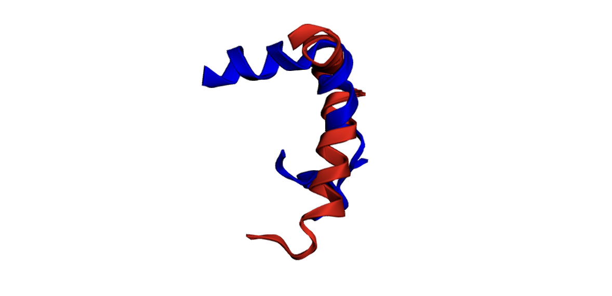

# Estructuras en tres dimensiones con Biopython

<div align="justify">
    
Este documento presenta un conjunto de ejercicios prácticos centrados en la bioinformática estructural y en el uso de herramientas computacionales como Biopython para analizar y manipular datos biológicos, específicamente relacionados con estructuras de proteínas y secuencias.

---

<br>

## **Ejercicio 1: Proteína de la hemoglobina humana**

En primer lugar, el archivo en formato PDB se descarga utilizando la función personalizada `download_pdb`, la cual obtiene el archivo a partir del identificador único de la proteína proporcionado por la base de datos PDB (Protein Data Bank). El código de la función se presenta a continuación:

```python
def download_pdb(pdb_id, route=None):
    pdb_id = pdb_id.lower()
    url = f"https://files.rcsb.org/download/{pdb_id.upper()}.pdb"
    respuesta = requests.get(url)

    if respuesta.status_code == 200:
        if route is None:
            route = f"{pdb_id.upper()}.pdb"
        else:
            if not route.endswith(".pdb"):
                route += ".pdb"
        with open(route, 'w') as archivo:
            archivo.write(respuesta.text)
        print(f"Archivo PDB '{pdb_id.upper()}.pdb' descargado exitosamente en '{route}'.")
        return route
    else:
        raise Exception(f"No se pudo descargar el PDB. Código de estado HTTP: {respuesta.status_code}")
```

La función utiliza el módulo `requests` para enviar una solicitud HTTP al servidor de PDB, valida la respuesta del servidor y, en caso de éxito, guarda el archivo en el directorio especificado por el usuario o en una ubicación predeterminada.

Posteriormente, se emplean dos herramientas para la visualización interactiva de estructuras tridimensionales de proteínas: la librería `nglview` y la librería `py3Dmol`. Estas herramientas permiten explorar las estructuras en detalle y generar representaciones gráficas. En la Figura 1 se muestra la estructura tridimensional de la hemoglobina humana, generada a partir del archivo descargado y visualizada con `py3Dmol`.

<div align="center">
    
    <p><b>Figura 1.</b> Representación tridimensional de la estructura de la hemoglobina humana.</p>
</div>

Finalmente, el archivo descargado se carga en Biopython para su análisis estructural. Esto se logra creando un objeto de tipo estructura mediante el módulo `PDBParser` de Biopython, como se ilustra en el siguiente código:

```python
parser = PDBParser(QUIET=True)
pdb_code = "1A3N"
structure = parser.get_structure(pdb_code, f"./files/{pdb_code}.pdb")
```

El objeto `structure` contiene toda la información sobre la organización atómica y molecular de la proteína, permitiendo realizar análisis y cálculos adicionales, como los descritos posteriormente.

### (a) Calcula la distancia entre los átomos O del primer y último residuo de la cadena A de la hemoglobina

Para calcular la distancia entre los átomos de oxígeno (O) correspondientes al primer y último residuo de la cadena A, se siguen los pasos descritos a continuación:

1. **Obtención de los residuos**. Se extraen el primer y último residuo de la cadena A utilizando el modelo de la estructura cargada:

```python
model = next(structure.get_models())  # Obtiene el primer modelo
chain_A = model['A']  # Selecciona la cadena A
residues = list(chain_A.get_residues())  # Lista de residuos en la cadena
first_residue = residues[0]  # Primer residuo
last_residue = residues[-1]  # Último residuo
```

2. **Obtención de los átomos de interés**. Se emplea la función `get_atom` para extraer los átomos de oxígeno (O) de los residuos seleccionados:

```python
def get_atom(residue, atom_id):
    try:
        return residue[atom_id]  # Recupera el átomo especificado
    except KeyError:
        print(f"El residuo {residue.get_resname()} {residue.id[1]} no tiene un átomo '{atom_id}'.")
        return None
 ```

3. **Cálculo de la distancia**. Una vez obtenidos los átomos, se calcula la distancia entre ellos en angstroms. Para ello, se define la función `calculate_distance`, que utiliza la operación de resta disponible para los objetos de tipo átomo en Biopython:

```python
def calculate_distance(atom1, atom2):
    distance = atom1 - atom2  # Calcula la distancia en línea recta
    return distance
```

4. **Visualización de la distancia calculada**. La distancia se representa visualmente mediante una imagen tridimensional, donde se destacan los átomos de interés. La **Figura 2** ilustra esta distancia en línea recta entre los átomos O del primer y último residuo:

<div align="center">
    
    <p><b>Figura 2.</b> Distancia entre los átomos O del primer y último residuo de la cadena A.</p>
</div>

### (b) Calcula el ángulo diedro entre los átomos N,CA,C, y O del primer residuo de la cadena A

El ángulo diedro es un ángulo de torsión que describe la disposición espacial de cuatro átomos conectados de forma secuencial. Este tipo de ángulo está estrechamente relacionado con las conformaciones locales y las estructuras secundarias de las proteínas, como las hélices alfa y las hojas beta. 

1. **Obtención de los átomos**. Se extraen los átomos especificados (N, CA, C y O) del primer residuo de la cadena A utilizando la función `get_atom`:

```python
atom_N = get_atom(first_residue, 'N')
atom_CA = get_atom(first_residue, 'CA')
atom_C = get_atom(first_residue, 'C')
atom_O = get_atom(first_residue, 'O')
```

2. **Extracción de las coordenadas**. Se obtienen los vectores posicionales de cada uno de los átomos seleccionados:

```python
coord_N = atom_N.get_vector()
coord_CA = atom_CA.get_vector()
coord_C = atom_C.get_vector()
coord_O = atom_O.get_vector()
```

3. **Cálculo del ángulo diedro**. Se utiliza la función `calc_dihedral` de Biopython, que calcula el ángulo de torsión basado en las posiciones de los cuatro átomos. El resultado, inicialmente en radianes, se convierte a grados mediante la función `np.degrees`:

```python
angle = calc_dihedral(coord_N, coord_CA, coord_C, coord_O)
angle_degrees = np.degrees(angle)
```
   
<div align="center">
    
    <p><b>Figura 3.</b> Ángulo diedro de los cuatro átomos.</p>
</div>

En este caso, el ángulo diedro calculado es de **-25.67º**. Este valor negativo indica que el ángulo de torsión está en el sentido contrario a las agujas del reloj cuando se observa desde el vector definido por los átomos N y CA hacia el vector definido por los átomos C y O.
Un ángulo diedro de **-25.67º** sugiere una ligera torsión que podría estar asociada con la formación de estructuras secundarias específicas, aunque no es un valor característico de una hélice alfa ni una hoja beta, que suelen tener ángulos más definidos. Este resultado destaca la flexibilidad conformacional del residuo inicial en la cadena A de la hemoglobina, un aspecto importante para su función biológica y estabilidad estructural.

### (c) Calcula el centro de masas de la estructura de la hemoglobina

El **centro de masas (center of mass)** de una estructura molecular se calcula como el promedio ponderado de las coordenadas de todos los átomos en la estructura, donde el peso de cada átomo es su masa. La fórmula es la siguiente:

$$
\text{Centro de masas (COM)} = \frac{\sum (m_i \cdot r_i)}{\sum m_i}
$$

Donde:
- $m_i$ es la masa del átomo $i$ (generalmente el peso atómico de su elemento).
- $r_i$ es el vector de coordenadas (x, y, z) del átomo $i$.
- La suma se realiza sobre todos los átomos de la estructura.

Información de las masas atómicas: [Disponible aquí](https://www.lenntech.es/periodica/masa/masa-atomica.htm)

1. **Identificación de los elementos presentes en la estructura**. Se recorren todos los átomos de la estructura para identificar los elementos únicos presentes. Esto permite asociar las masas atómicas adecuadas a cada elemento:

```python
unique_elements = set()
for atom in structure.get_atoms():
    element = atom.element.strip().upper()
    unique_elements.add(element)
```
En el caso de la hemoglobina, los elementos identificados son: `'FE'`(Hierro), `'O'`(Oxígeno), `'S'`(Sulfuro), `'N'`(Nitrógeno) y `'C'`(Carbono).

2. **Cálculo de las coordenadas ponderadas por la masa**. Para cada átomo, se extraen sus coordenadas ($x, y, z$)) y se ponderan por su masa atómica. Al mismo tiempo, se acumula la masa total de todos los átomos:

```python
atomic_mass = 0.0
sum_x = 0.0
sum_y = 0.0
sum_z = 0.0
for atom in structure.get_atoms():
    element = atom.element.strip().upper()
    masa = get_mass(element)  # Función que retorna la masa atómica
    x, y, z = atom.get_coord()
    atomic_mass += masa
    sum_x += masa * x
    sum_y += masa * y
    sum_z += masa * z
```

3. **Obtención del centro de masas**. Dividiendo las coordenadas ponderadas ($\sum m_i \cdot x, \sum m_i \cdot y, \sum m_i \cdot z$) por la masa total ($\sum m_i$), se obtiene el centro de masas como un vector tridimensional:

```python
centro_masas = np.array([sum_x, sum_y, sum_z]) / atomic_mass
```

4. **Visualización del resultado**. El centro de masas calculado ($14.45, 2.01, 13.18$) se representa gráficamente para resaltar su posición en la estructura de la hemoglobina. En la **Figura 4**, se observa el centro de masas como un punto destacado en la estructura tridimensional:

<div align="center">
    
    <p><b>Figura 4.</b> Centro de masas de la hemoglobina representado como un punto destacado.</p>
</div>

En el caso de la hemoglobina, se encuentra cerca del núcleo de la estructura, lo cual es consistente con su configuración compacta y su función biológica de transporte de oxígeno en el organismo. Este análisis puede ser extendido a otras proteínas para evaluar la distribución de masa y su relación con propiedades estructurales y funcionales.

---

<br>

## **Ejercicio 2: Proteína lisozima del huevo de la gallina**

En primer lugar, al igual que en el ejercicio 1, el archivo en formato PDB se descarga utilizando la función personalizada `download_pdb`, la cual obtiene el archivo a partir del identificador único de la proteína proporcionado por la base de datos PDB (Protein Data Bank).

Posteriormente, se emplean dos herramientas para la visualización interactiva de estructuras tridimensionales de proteínas: la librería `nglview` y la librería `py3Dmol`. 

<div align="center">
    
    <p><b>Figura 5.</b> Representación tridimensional de la estructura de la lisozima.</p>
</div>

Finalmente, el archivo descargado se carga en Biopython para su análisis estructural. Esto se logra creando un objeto de tipo estructura mediante el módulo `PDBParser`. El objeto `structure` contiene toda la información sobre la organización atómica y molecular de la proteína, permitiendo realizar análisis y cálculos adicionales, como los descritos posteriormente.

### (a) Número de átomos y nombres del primer y último átomo en la lista

Este apartado tiene como objetivo determinar el número total de átomos presentes en la estructura de la lisozima y especificar el nombre del primer y último átomo en la lista de átomos de la estructura.

1. **Obtención de la lista de átomos**. Se genera una lista que contiene todos los átomos de la estructura utilizando el método `get_atoms`:

```python
atoms = list(structure.get_atoms())
```

2. **Cálculo del número total de átomos**. La longitud de la lista de átomos se determina mediante la función `len`, lo que proporciona el número total de átomos en la estructura:

```python
num_atoms = len(atoms)
```
En este caso, la proteína de la lisozima contiene **$1.102$** átomos.

3. **Obtención de los nombres del primer y último átomo**. Se acceden al primer y último átomo en la lista mediante índices y se extraen sus nombres utilizando el método `get_name`:

```python
first_atom = atoms[0].get_name()
last_atom = atoms[-1].get_name()
```

En este caso:
- El **primer átomo** es un átomo de nitrógeno (`N`).
- El **último átomo** es un átomo de oxígeno (`O`).

4. **Visualización de los resultados**. La **Figura 6** muestra la estructura tridimensional de la lisozima, donde se destacan claramente el primer y el último átomo:

<div align="center">
    
    <p><b>Figura 6.</b> Primer y último átomo de la lisozima.</p>
</div>

El análisis realizado confirma que la estructura de la lisozima contiene un total de **1,102 átomos**. El **primer átomo** identificado es un átomo de nitrógeno (`N`), y el **último átomo** es un átomo de oxígeno (`O`). 

### (b) Cálculo del ángulo entre los tres primeros átomos de la lista

El cálculo del ángulo entre tres átomos se basa en la geometría molecular y utiliza las posiciones de los átomos en el espacio tridimensional. El ángulo se obtiene a partir de los vectores de posición de los tres átomos, calculando el ángulo entre ellos utilizando funciones específicas de Biopython.

1. **Obtención de los vectores de los tres primeros átomos**. Se seleccionan los tres primeros átomos de la lista y se extraen sus vectores de posición tridimensionales ($x, y, z$):

```python
atom1, atom2, atom3 = atoms[0], atoms[1], atoms[2]
vector1 = atom1.get_vector()
vector2 = atom2.get_vector()
vector3 = atom3.get_vector()
```

2. **Cálculo del ángulo en radianes**. Se utiliza la función `calc_angle` de Biopython, que calcula el ángulo formado por tres vectores en radianes:

```python
angle = calc_angle(vector1, vector2, vector3)
```

3. **Conversión del ángulo a grados**. El ángulo calculado en radianes se convierte a grados utilizando la función `math.degrees`:

```python
angle_deg = math.degrees(angle)
```

En este caso, el ángulo calculado es **118.36 grados**.

4. **Visualización del ángulo**. La **Figura 7** ilustra gráficamente la disposición de los tres primeros átomos y el ángulo calculado entre ellos:

<div align="center">
    
    <p><b>Figura 7.</b> Representación del ángulo entre los tres primeros átomos de la lisozima.</p>
</div>

### (c) Identificación de la cadena y el residuo del átomo central de la lista

Este apartado tiene como objetivo identificar el átomo que se encuentra en la posición central de la lista de átomos, así como su cadena y residuo correspondiente. Este análisis se basa en las estructuras de datos y clases proporcionadas por Biopython.

1. **Obtención del índice y del átomo central**. El índice del átomo central se calcula dividiendo el número total de átomos (`num_atoms`) entre dos, utilizando la división entera para garantizar un índice válido. A partir de este índice, se obtiene el átomo central:

```python
middle_index = num_atoms // 2
middle_atom = atoms[middle_index]
```

2. **Obtención de la cadena y el residuo del átomo**
Mediante la jerarquía de clases de Biopython, se obtienen los elementos relacionados con el átomo:
- **Residuo**: Se obtiene utilizando el método `get_parent` aplicado al átomo.
- **Cadena**: Se obtiene aplicando `get_parent` al residuo.
- **Información del residuo**: A partir del objeto residuo, se extraen el nombre del residuo (`get_resname`) y su número (`get_id}[1]`).
- **ID de la cadena**: Se obtiene con el método `get_id` del objeto cadena.

```python
residue = middle_atom.get_parent()
chain = residue.get_parent()
chain_id = chain.get_id()
residue_id = residue.get_id()
residue_name = residue.get_resname()
residue_number = residue_id[1]
```

4. **Resultados**  
En este caso, el átomo central se encuentra en la posición **551** de la lista de átomos. Este átomo es un **nitrógeno (`N`)** que pertenece:
- A la **cadena `A`** (única en la estructura).
- Al **residuo `PRO` (prolina)** con número **70**.

5. **Visualización del átomo central**. La **Figura 8** muestra gráficamente la ubicación del átomo central y su residuo correspondiente dentro de la estructura tridimensional:

<div align="center">
    
    <p><b>Figura 8.</b> Representación del átomo central y su residuo.</p>
</div>

El átomo central identificado es un **nitrógeno (`N`)** del residuo **prolina (`PRO`)** en la **cadena `A`** de la proteína. La prolina es un aminoácido que desempeña un papel especial en las estructuras proteicas debido a su geometría rígida, que puede influir en la flexibilidad y estabilidad de la proteína. 

---

<br>

## **Ejercicio 3: Orexina-A y Orexina-B, neuropéptidos reguladores del sueño**

#### Introducción
En este ejercicio, se exploran las características estructurales, funcionales y evolutivas de dos proteínas clave implicadas en la regulación del sueño y otros procesos biológicos esenciales: **Orexina-A/Hipocretina-1 (1WSO)** y **Orexina-B/Hipocretina-2 (1CQ0)**. A través del análisis tridimensional, búsquedas de homólogos y la construcción de árboles filogenéticos, se busca entender las similitudes y diferencias entre estas proteínas, sus relaciones evolutivas y su papel en organismos como el ser humano.

La Orexina-A y la Orexina-B son neuropéptidos producidos en el hipotálamo que desempeñan un papel crítico en la regulación del ciclo sueño-vigilia, el apetito y la homeostasis energética. Aunque comparten un precursor común, presentan diferencias notables en su estructura y funcionalidad. Este análisis aborda tanto las similitudes que permiten su funcionalidad compartida como las diferencias que explican sus afinidades específicas por distintos receptores.

---

### Visualización y Exploración de las Estructuras Tridimensionales
Las proteínas 1WSO y 1CQ0 se cargaron utilizando la librería `Bio.PDB` y se visualizaron mediante herramientas como `nglview` y `py3Dmol`. Estas visualizaciones revelaron detalles importantes:

1. **Estructura de 1WSO (Orexina-A):**
   - La proteína muestra una hélice alfa prominente, con una organización compacta y una estructura secundaria bien definida. Esta hélice alfa es crucial para su interacción con los receptores OX1R y OX2R.

<div align="center">
    
    <p><b>Figura 9.</b> Representación de la Orexina-A (1WSO)</p>
</div>

   - Se identificaron residuos no estándar, como PCA y NH₂. Estos residuos, aunque pequeños, desempeñan un papel importante en la estabilización de la estructura o en su funcionalidad experimental.

<div align="center">
    
    <p><b>Figura 10.</b> Representación de la Orexina-A (1WSO)</p>
</div>

2. **Estructura de 1CQ0 (Orexina-B):**
   - A diferencia de 1WSO, esta proteína es más compacta y tiene menos flexibilidad en sus extremos terminales, lo que refuerza su interacción específica con el receptor OX2R.

<div align="center">
    
    <p><b>Figura 11.</b> Representación de la Orexina-A (1WSO)</p>
</div>

   - La estructura presenta una única hélice alfa continua, que también es fundamental para sus funciones biológicas.

---

### Alineación de Proteínas
El alineamiento entre las estructuras de **Orexina-A** y **Orexina-B** genera tres componentes principales: la matriz de rotación, el vector de traslación, y el valor de RMSD. Aquí explicamos cada uno en detalle usando notación matemática.

##### 1. **Matriz de rotación ($R$)**

La matriz de rotación $R$ es:

$$
R = 
\begin{bmatrix}
1.00000000 & -1.31074131 \times 10^{-8} &  9.74082657 \times 10^{-8} \\
1.31074154 \times 10^{-8} & 1.00000000 & -2.44023484 \times 10^{-8} \\
-9.74082652 \times 10^{-8} & 2.44023494 \times 10^{-8} & 1.00000000
\end{bmatrix}
$$

Esto indica una rotación mínima. Los valores cercanos a 1 en la diagonal principal muestran que no hay un cambio significativo en la orientación de los ejes $x$, $y$ y $z$. Los valores fuera de la diagonal son muy pequeños ($\sim 10^{-8}$), indicando ligeras correcciones necesarias para la alineación.

En términos generales, si un punto $P$ en la estructura móvil tiene coordenadas $(x, y, z)$, después de aplicar esta rotación, sus nuevas coordenadas serían:

$$
P' = R \cdot P
$$

##### 2. **Vector de traslación ($T$)**

El vector de traslación $T$ es:

$$
T = 
\begin{bmatrix}
-1.10392905 \times 10^{-6} \\
1.58119236 \times 10^{-7} \\
-7.35061366 \times 10^{-7}
\end{bmatrix}
$$

Este vector indica un desplazamiento mínimo necesario para alinear las estructuras en el espacio tridimensional. El desplazamiento en los tres ejes ($x$, $y$, $z$) es muy pequeño ($\sim 10^{-6}$), lo que sugiere que las dos estructuras ya estaban bastante alineadas en términos de posición antes de aplicar esta traslación.

La nueva posición de un punto después de aplicar rotación y traslación será:

$$
P'' = R \cdot P + T
$$

##### 3. **RMSD (Root Mean Square Deviation)**

El valor de RMSD ($\text{RMSD}$) es:
$$
\text{RMSD} = 7.47 \, \text{Å}
$$

La RMSD se calcula usando:

$$
\text{RMSD} = \sqrt{\frac{1}{N} \sum_{i=1}^N \left\| P_{1i} - P_{2i} \right\|^2}
$$

Donde:
- $N$ es el número de átomos considerados para el alineamiento (átomos alfa-carbono $CA$).
- $P_{1i}$ y $P_{2i}$ son las posiciones de los átomos correspondientes en las dos estructuras después de la alineación.
- $\left\| P_{1i} - P_{2i} \right\|$ es la distancia euclidiana entre el $i$-ésimo átomo de las dos estructuras.

El RMSD de **7.47 Å** indica una desviación significativa entre las posiciones de los átomos en las dos estructuras. Esto refleja diferencias estructurales en las regiones flexibles o específicas, como las terminaciones o las secuencias que no son estructuralmente conservadas.

Podemos ahora visualizar las proteínas, una vez aplicadas las transformaciones y rotaciones necesarias para el alineamiento. El resultado es el mostrado en las siguientes gráficas:


3. **RMSD (Root Mean Square Deviation)**:

$$
\text{RMSD} = \sqrt{\frac{1}{N} \sum_{i=1}^N \left| P_{1i} - P_{2i} \right|^2} = 7.47 , \text{Å}
$$

   Este valor refleja diferencias estructurales significativas, particularmente en las regiones terminales y flexibles de las proteínas.

La visualización de las proteínas alineadas mostró una conservación en las hélices alfa principales y diferencias en las regiones periféricas, destacando tanto similitudes funcionales como adaptaciones estructurales específicas.

<div align="center">
    
    <p><b>Figura 12.</b> Alineación estructural de las proteínas 1WSO y 1CQ0.</p>
</div>

<div align="center">
    
    <p><b>Figura 13.</b> Alineación estructural de las proteínas 1WSO y 1CQ0.</p>
</div>

Una vez realizado el alineamiento, podemos concluir que las estructuras de **Orexina-A** y **Orexina-B** comparten un núcleo estructural conservado, como se evidencia en la superposición de las hélices alfa principales. Esto confirma su similitud en las regiones funcionales críticas para la interacción con los receptores de orexina. Sin embargo, el valor de **RMSD (7.47 Å)** indica diferencias significativas en algunas regiones, particularmente en las partes más flexibles o terminales, que no se alinean perfectamente.

El **vector de traslación** y la **matriz de rotación** reflejan que solo se requirieron ajustes mínimos para superponer las estructuras, lo que reafirma que ambas proteínas tienen una base estructural similar. Las discrepancias observadas son consistentes con sus diferencias en la secuencia de aminoácidos y longitud, lo cual podría explicar sus afinidades y roles funcionales diferenciados hacia los receptores OX1R y OX2R. En conclusión, el alineamiento destaca las similitudes fundamentales necesarias para su función compartida como neuropéptidos reguladores, pero también resalta las adaptaciones estructurales específicas que permiten a cada proteína cumplir con sus roles fisiológicos únicos.

---

### Búsqueda de Homólogos usando BLAST

#### **Orexina-A/Hipocretina-1 (1WSO)**

La identificación de secuencias homólogas para la Orexina-A (1WSO) se realizó utilizando la herramienta **BLASTP**. Este enfoque permite encontrar proteínas con similitudes significativas en la base de datos no redundante (**NR**) y analizar sus relaciones evolutivas. A continuación, se detalla el procedimiento llevado a cabo:

1. **Carga de Secuencias**
   Las secuencias de las proteínas se obtuvieron desde archivos en formato FASTA. Estas se cargaron mediante herramientas especializadas para garantizar una correcta estructuración de los datos.

   ```python
   loader = DataLoaderFactory.get_loader("fasta")
   sequence_1wso = loader.load(data_path + "/rcsb_pdb_1WSO.fasta")
   print("Secuencia 1WSO:", sequence_1wso)
   ```

2. **Realización de Búsqueda BLAST**
   Se ejecutó la función `search_online_sequences` para buscar homólogos en la base de datos NR. Esta función automatiza el proceso de búsqueda y extracción de información clave, como el organismo de origen, la longitud del alineamiento, el valor **E** y la puntuación (**score**).

   ```python
   def search_online_sequences(sequence):
       result = NCBIWWW.qblast("blastp", "nr", sequence)
       blast_records = NCBIXML.read(result)

       data = []
       if not blast_records.alignments:
           print("No se encontraron resultados.")
           return pd.DataFrame()
       
       for alignment in blast_records.alignments:
           organism = alignment.title
           sequence_data = alignment.hsps[0].align_length
           e_value = alignment.hsps[0].expect
           score = alignment.hsps[0].score
           
           data.append({
               "Organismo": organism,
               "Secuencia": sequence_data,
               "E-value": e_value,
               "Score": score
           })
       
       return pd.DataFrame(data)

   df_homolog_1wso = search_online_sequences(sequence_1wso)
   ```

3. **Análisis y Filtrado de Resultados**
   Los resultados se ordenaron según el valor **E**, priorizando las alineaciones más significativas. Además, se filtraron los resultados para identificar los homólogos más cercanos en términos evolutivos, centrándonos especialmente en aquellos relacionados con *Homo sapiens*.

   ```python
   df_homolog_1wso = df_homolog_1wso.sort_values(by="E-value", ascending=True)
   filtered_homologs_1wso = df_homolog_1wso[df_homolog_1wso["Organismo"].str.contains("Homo sapiens", na=False)]
   ```

   Como resultado, se identificó que la cadena **A** de la proteína **1R02** (Orexina-A humana) es el homólogo más similar a la **1WSO**. Esto es esperable, ya que ambas pertenecen al mismo organismo (*Homo sapiens*).

4. **Obtención de Estructuras PDB**
   Se descargaron las estructuras de **1WSO** y **1R02** para realizar un análisis más detallado. Este paso incluyó un alineamiento atómico de ambas proteínas, utilizando la librería **Biopython**, para comparar sus estructuras tridimensionales.

   ```python
   parser = PDB.PDBParser()
   structure_1wso = parser.get_structure("1WSO", data_path + "/1wso.pdb")
   structure_1r02 = parser.get_structure("1R02", data_path + "/1r02.pdb")
   atomic_aligner = Superimposer()
   atomic_aligner.align(structure_1wso, structure_1r02, chain1_id="A", chain2_id="A")
   ```

5. **Visualización y Comparación de Estructuras**
   Se visualizaron las estructuras alineadas para evaluar su conservación estructural. Este análisis reveló una notable superposición en las regiones centrales de ambas proteínas, especialmente en las hélices alfa principales.

<div align="center">
    
    <p><b>Figura 14.</b> Alineación estructural de 1WSO (Azul) y 1R02 (Rojo).</p>
</div>

#### **Orexina-B/Hipocretina-2 (1CQ0)**

Se utilizó un procedimiento similar al descrito para la Orexina-A, centrado en identificar los homólogos de la **Orexina-B (1CQ0)**. Entre los resultados destacados, se identificó que la cadena **L** de la proteína **7L1U** es un homólogo significativo.

<div align="center">
    
    
    <p><b>Figura 15.</b> Comparación de 1CQ0 (Azul) y 7L1U_L (Rojo).</p>
</div> 

La conservación estructural en regiones críticas sugiere funciones biológicas compartidas, mientras que las diferencias reflejan posibles adaptaciones funcionales específicas.

### Construcción de Árboles Filogenéticos

#### Preparación de datos
Primero, generamos los ficheros en formato FASTA necesarios, accediendo para ello a NCBI y seleccionando todas las proteínas relevantes. Estas se exportaron en formato FASTA para ser utilizadas en la construcción de los árboles filogenéticos.

#### Alineamiento de secuencias
Con los ficheros FASTA listos, se utilizó **CLUSTAL Omega**, una herramienta de alineamiento múltiple de secuencias que permite comparar y alinear secuencias de proteínas o ADN. Este alineamiento es crucial para identificar regiones conservadas y generar la base del análisis filogenético.

```python
fasta_file = "sequences/combined_orexin_a.fasta"
aligned_file = "sequences/combined_orexin_a_aligned.fasta"
clustalomega_cline = ClustalOmegaCommandline(
    infile=fasta_file, 
    outfile=aligned_file, 
    verbose=True, 
    auto=True, 
    force=True
)
clustalomega_cline()
```

#### Árbol filogenético con el método Neighbor Joining
Se construyó un árbol filogenético utilizando el método **Neighbor Joining** (NJ). Este método, basado en la distancia entre secuencias, genera un árbol jerárquico que refleja la relación evolutiva entre las secuencias.

```python
alignment = AlignIO.read(aligned_file, "fasta")
calculator = DistanceCalculator("identity")
distance_matrix = calculator.get_distance(alignment)
constructor = DistanceTreeConstructor(calculator, method="nj")
tree = constructor.build_tree(alignment)
```

<div align="center">
    
    <p><b>Figura 16.</b> Árbol filogenético para Orexina-A utilizando el método Neighbor Joining.</p>
</div>

#### Análisis del árbol
El análisis del árbol permitió identificar las relaciones evolutivas más cercanas entre las proteínas:

- La proteína más cercana a **1WSO** fue la Orexina A y B precursora de la especie *Ovis aries*.
- Este resultado sugiere que las estructuras y funciones de estas proteínas están altamente conservadas en mamíferos.

#### Árbol filogenético con el método UPGMA
Se generó un nuevo árbol utilizando el método **UPGMA** (Unweighted Pair Group Method with Arithmetic Mean). Este método, también basado en la distancia, agrupa secuencias de manera jerárquica considerando la media aritmética de las distancias.

```python
constructor = DistanceTreeConstructor(calculator, method="upgma")
tree = constructor.build_tree(alignment)
```

<div align="center">
    
    <p><b>Figura 17.</b> Árbol filogenético para Orexina-A utilizando el método UPGMA.</p>
</div>

Los resultados obtenidos con UPGMA fueron consistentes con los de Neighbor Joining, confirmando que *Ovis aries* tiene la relación evolutiva más cercana a **1WSO**.

#### Análisis de Orexina-B (1CQ0)
Se siguió el mismo procedimiento para la proteína **Orexina-B (1CQ0)**:

1. Alineamiento de secuencias:
   ```python
   fasta_file = "sequences/combined_orexin_b.fasta"
   aligned_file = "sequences/combined_orexin_b_aligned.fasta"
   clustalomega_cline = ClustalOmegaCommandline(
       infile=fasta_file, 
       outfile=aligned_file, 
       verbose=True, 
       auto=True, 
       force=True
   )
   clustalomega_cline()
   ```

2. Construcción del árbol con Neighbor Joining:
   ```python
   alignment = AlignIO.read(aligned_file, "fasta")
   tree = constructor.build_tree(alignment)
   ```

<div align="center">
    
    <p><b>Figura 18.</b> Árbol filogenético para Orexina-B utilizando el método Neighbor Joining.</p>
</div>

En este caso, se observó que el homólogo más cercano a **1CQ0** fue la cadena L de la Orexina del *Homo sapiens* (7L1U), en línea con lo esperado.

---

#### Conclusiones del Análisis Evolutivo
El análisis filogenético y estructural destaca cómo la Orexina-A y la Orexina-B han evolucionado para cumplir funciones específicas en diferentes especies. La conservación de las hélices alfa principales subraya la importancia de estas regiones en la interacción con los receptores OX1R y OX2R. Las diferencias en las regiones terminales reflejan adaptaciones funcionales que podrían estar relacionadas con la especificidad de cada proteína hacia diferentes receptores o contextos fisiológicos. Este análisis no solo proporciona una visión detallada de las relaciones evolutivas, sino que también resalta la utilidad de herramientas computacionales en el estudio de la biología molecular.

---

### Máximas distancias entre átomos
Por último, hemos desarrollado una función, `max_distance_between_atoms`, que nos permite calcular la máxima distancia entre los átomos de una estructura concreta. Para ello, tenemos en cuenta que la librería `Bio.PDB` de Biopython nos permite acceder a las coordenadas de los átomos de una proteína, y que la distancia entre dos puntos en un espacio tridimensional se puede calcular mediante la fórmula de la distancia euclidiana.

(*) Algo importante a tener en cuenta es que la libería `Bio` permite calcular la distancia euclidea entre dos átomos, `atom1`y `atom2`, mediante la función `atom1 - atom2`. Esto es, la diferencia entre las coordenadas de los dos átomos es equivalente a la distancia euclidea entre ellos, dada por

$$
\sqrt{(x_1 - x_2)^2 + (y_1 - y_2)^2 + (z_1 - z_2)^2}
$$

siendo $(x_1, y_1, z_1)$ y $(x_2, y_2, z_2)$ las coordenadas en un espacio tridimensional de los átomos `atom1` y `atom2`, respectivamente.

```python
def max_distance_between_atoms(structure):
    atoms = list(structure.get_atoms())
    max_distance = 0
    for i, atom1 in enumerate(atoms):
        for atom2 in atoms[i+1:]:
            distance = atom1 - atom2
            if distance > max_distance:
                max_distance = distance
    return max_distance
```

Calcularemos la máxima distancia entre átomos para las dos estructuras de proteínas que estamos estudiando, Orexina-A/Hipocretina-1 y Orexina-B/Hipocretina-2. El resultado obtenido es el siguiente:

```python
def compare_proteins_max_distance(pdb_file1, pdb_file2):
    parser = PDB.PDBParser(QUIET=True)

    structure1 = parser.get_structure("Protein1", pdb_file1)
    structure2 = parser.get_structure("Protein2", pdb_file2)

    max_distance1 = max_distance_between_atoms(structure1)
    max_distance2 = max_distance_between_atoms(structure2)

    if max_distance1 > max_distance2:
        return f"La proteína del archivo '{pdb_file1}' tiene la mayor distancia entre átomos: {max_distance1:.2f} Å\nLa proteína del archivo '{pdb_file2}' tiene una distancia máxima entre átomos de {max_distance2:.2f} Å"
    elif max_distance2 > max_distance1:
        return f"La proteína del archivo '{pdb_file2}' tiene la mayor distancia entre átomos: {max_distance2:.2f} Å\nLa proteína del archivo '{pdb_file1}' tiene una distancia máxima entre átomos de {max_distance1:.2f} Å"
    else:
        return f"Ambas proteínas tienen la misma distancia máxima entre átomos: {max_distance1:.2f} Å"

pdb_file1 = data_path + "/1WSO.pdb"
pdb_file2 = data_path + "/1CQ0.pdb"

result = compare_proteins_max_distance(pdb_file1, pdb_file2)
print(result)
```

```text
La proteína del archivo './data/1WSO.pdb' tiene la mayor distancia entre átomos: 44.66 Å
La proteína del archivo './data/1CQ0.pdb' tiene una distancia máxima entre átomos de 34.73 Å
```

Esta diferencia entre ambas proteínas era algo que no se apreciaba de una forma tan clara en la representación de ambas proteínas en un mismo espacio, como se puede apreciar en la Figura 19.

<div align="center">
    
    <p><b>Figura 19.</b> Comparación de las distancias máximas entre átomos de las proteínas 1WSO y 1CQ0.</p>
</div>

Ahora bien, ¿Por qué la proteína de la Orexina-A tiene una mayor distancia máxima entre átomos que la Orexina-B? La respuesta a esta pregunta radica en las diferencias estructurales y funcionales entre las proteínas. La Orexina-A sabemos que posee una serie de ligandos y residuos no estándar que pueden influir en la disposición de los átomos y, por ende, en la distancia máxima entre ellos.

<div align="center">
    
    <p><b>Figura 20.</b> Distancia máxima entre átomos de la proteína 1WSO.</p>
</div>

<div align="center">
    
    <p><b>Figura 21.</b> Distancia máxima entre átomos de la proteína 1CQ0.</p>
</div>

Concluimos, por tanto, que la proteína de la Orexina-A/Hipocretina-1 (1WSO) tiene una mayor distancia entre sus átomos que la Orexina-B/Hipocretina-2 (1CQ0), lo cual es consistente con las diferencias estructurales y funcionales observadas entre ambas proteínas. La presencia de ligandos adicionales en la Orexina-A podría contribuir a esta mayor distancia, lo que destaca la importancia de considerar la estructura completa de las proteínas al evaluar sus propiedades físicas y biológicas. Además, la comparación de las distancias entre átomos puede proporcionar información adicional sobre la estabilidad, la interacción con otras moléculas y la función de las proteínas, lo que es crucial para comprender su papel en los procesos biológicos y su relevancia en la salud y la enfermedad.

Esta mayor distancia también sugiere que la Orexina-A podría tener mayor flexibilidad estructural, lo que influiría en su capacidad para interactuar con diferentes receptores o adaptarse a diversos entornos moleculares. Esto podría explicar, en parte, su versatilidad funcional y su implicación en múltiples procesos fisiológicos. Por otro lado, las diferencias en compactación podrían tener implicaciones en la eficiencia del plegamiento y en la estabilidad de la proteína, aspectos clave en el diseño de fármacos que buscan modular la actividad de estas moléculas en el tratamiento de trastornos relacionados con el sistema orexinérgico.

---

### Conclusión
Este análisis detallado de las proteínas 1WSO y 1CQ0 demuestra cómo herramientas computacionales pueden desentrañar complejidades estructurales y evolutivas. La conservación de las hélices alfa principales subraya su importancia funcional, mientras que las diferencias en regiones flexibles reflejan adaptaciones específicas. Estas proteínas son un ejemplo fascinante de cómo la evolución puede preservar funciones esenciales mientras ajusta estructuras para satisfacer necesidades biológicas específicas.

</div>
